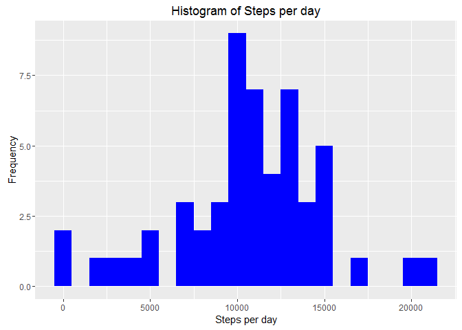
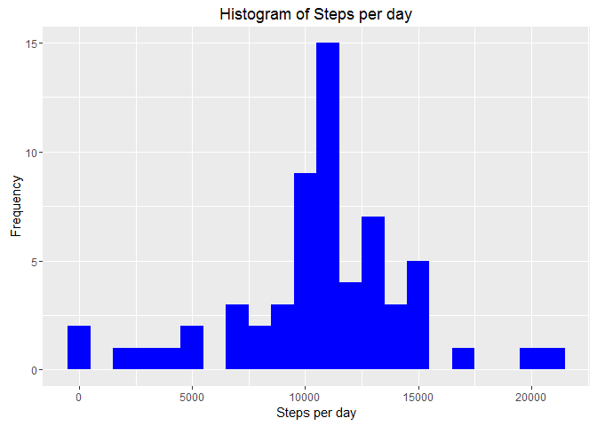

# Reproducible Research: Peer Assessment 1

## R Setup

```r
library(knitr)
opts_chunk$set(echo = TRUE)
```

## Load required libraries

```r
library(dplyr)
```

```
## 
## Attaching package: 'dplyr'
```

```
## The following objects are masked from 'package:stats':
## 
##     filter, lag
```

```
## The following objects are masked from 'package:base':
## 
##     intersect, setdiff, setequal, union
```

```r
library(lubridate)
```

```
## 
## Attaching package: 'lubridate'
```

```
## The following object is masked from 'package:base':
## 
##     date
```

```r
library(ggplot2)
```

## Loading and preprocessing the data

Data is loaded using read.csv()
Data file is already downloaded and saved under data/ folder 
within the current working directory.


```r
activityData <- read.csv(".\\data\\activity.csv"
                         , header=TRUE
                         , colClasses=c("numeric", "character", "integer"))
```

## Check and change data formats, if required.

Check data structure and sample

```r
str(activityData)
```

```
## 'data.frame':	17568 obs. of  3 variables:
##  $ steps   : num  NA NA NA NA NA NA NA NA NA NA ...
##  $ date    : chr  "2012-10-01" "2012-10-01" "2012-10-01" "2012-10-01" ...
##  $ interval: int  0 5 10 15 20 25 30 35 40 45 ...
```

```r
head(activityData)
```

```
##   steps       date interval
## 1    NA 2012-10-01        0
## 2    NA 2012-10-01        5
## 3    NA 2012-10-01       10
## 4    NA 2012-10-01       15
## 5    NA 2012-10-01       20
## 6    NA 2012-10-01       25
```

```r
summary(activityData)
```

```
##      steps            date              interval     
##  Min.   :  0.00   Length:17568       Min.   :   0.0  
##  1st Qu.:  0.00   Class :character   1st Qu.: 588.8  
##  Median :  0.00   Mode  :character   Median :1177.5  
##  Mean   : 37.38                      Mean   :1177.5  
##  3rd Qu.: 12.00                      3rd Qu.:1766.2  
##  Max.   :806.00                      Max.   :2355.0  
##  NA's   :2304
```

We see that there are missing values in "steps" 
and date is of format yyyy-mm-dd

## Data Transformation and Processing 

Set "date" to proper date format using lubridate

```r
activityData$date <- ymd(activityData$date)
```

## What is mean total number of steps taken per day?

Calculate Steps per Day

```r
dsteps <- activityData %>%
  filter(!is.na(steps)) %>%
  group_by(date) %>%
  summarize(dsteps = sum(steps)) %>%
  print
```

```
## # A tibble: 53 × 2
##          date dsteps
##        <date>  <dbl>
## 1  2012-10-02    126
## 2  2012-10-03  11352
## 3  2012-10-04  12116
## 4  2012-10-05  13294
## 5  2012-10-06  15420
## 6  2012-10-07  11015
## 7  2012-10-09  12811
## 8  2012-10-10   9900
## 9  2012-10-11  10304
## 10 2012-10-12  17382
## # ... with 43 more rows
```

Calculate Mean and Median steps per day


```r
steps_mean    <- mean(dsteps$dsteps, na.rm = TRUE)
steps_median <- median(dsteps$dsteps, na.rm = TRUE)

steps_mean
```

```
## [1] 10766.19
```

```r
steps_median
```

```
## [1] 10765
```

Mean of total steps per day   : 10766.19

Median of total steps per day : 10765

1. Plot histogram of steps per day


```r
ggplot(dsteps, aes(x = dsteps)) +
  geom_histogram( fill="blue", binwidth=1000) +
  labs(title = "Histogram of Steps per day", x = "Steps per day", y = "Frequency")
```

<!-- -->


## What is the average daily activity pattern?

Calculate average steps taken in each 5-min interval per day.


```r
intervals <- activityData %>%
  filter(!is.na(steps))   %>%
  group_by(interval)      %>%
  summarize(steps = mean(steps))
```

1. Time series plot of the 5 min interval and average number of steps
across all days

We will use plot to make this time series plot

```r
plot(intervals$interval
    ,intervals$steps
    ,type="l"
    ,col="red"
    ,xlab = "Interval", ylab="Steps"
    ,main="Average Steps per 5 min Interval")
```

<!-- -->

2. Which 5-minute interval, on average across all the days in the dataset, contains the maximum number of steps?

This can be calculated using which.max()


```r
maxstepInt <-intervals[which.max(intervals$steps),]
```
Max Steps (average) in an Interval : 206

Interval with max Steps (average)  : 835


## Imputing missing values
1. Calculate and report the total number of missing values in the dataset (i.e. the total number of rows with NAs)

```r
countMissingValues <- sum(is.na(activityData$steps))
```
Count of missing values : 2304

2. Devise a strategy for filling in all of the missing values in the dataset
We will use the average steps for a given interval to fill in missing steps

3. Create a new dataset that is equal to the original dataset but with the missing data filled in with average steps for that interval


```r
activityData2 <- activityData
missingVals <- is.na(activityData$steps)
avgSteps <- tapply(activityData2$steps, activityData2$interval
                       ,mean
                       ,na.rm=TRUE
                       ,simplify=TRUE
                      )
activityData2$steps[missingVals] <- avgSteps[as.character( 
                                       activityData2$interval[missingVals]
                                       )]
```

Check for missing values in the original and new datasets

```r
countMissingValues  <- sum(is.na(activityData$steps))
countMissingValues2 <- sum(is.na(activityData2$steps))
```

Missing values in original dataset: 2304

Missing values in new dataset     : 0

4. Histogram of the total number of steps taken each day and Calculate and report the mean and median total number of steps taken per day

Calculate Steps per Day using imputed dataset

```r
dsteps2 <- activityData2 %>%
  filter(!is.na(steps)) %>%
  group_by(date) %>%
  summarize(dsteps = sum(steps)) %>%
  print
```

```
## # A tibble: 61 × 2
##          date   dsteps
##        <date>    <dbl>
## 1  2012-10-01 10766.19
## 2  2012-10-02   126.00
## 3  2012-10-03 11352.00
## 4  2012-10-04 12116.00
## 5  2012-10-05 13294.00
## 6  2012-10-06 15420.00
## 7  2012-10-07 11015.00
## 8  2012-10-08 10766.19
## 9  2012-10-09 12811.00
## 10 2012-10-10  9900.00
## # ... with 51 more rows
```
Calculate Mean and Median steps per day using the new dataset


```r
steps_mean2    <- mean(dsteps2$dsteps, na.rm = TRUE)
steps_median2 <- median(dsteps2$dsteps, na.rm = TRUE)

steps_mean2
```

```
## [1] 10766.19
```

```r
steps_median2
```

```
## [1] 10766.19
```

Mean of total steps per day   : 10766.19

Median of total steps per day : 10766.19

*We see that the the mean and median are same with imputed missing values dataset*


Plot Histogram

```r
ggplot(dsteps2, aes(x = dsteps)) +
  geom_histogram( fill="blue", binwidth=1000) +
  labs(title = "Histogram of Steps per day", x = "Steps per day", y = "Frequency")
```

<!-- -->


## Are there differences in activity patterns between weekdays and weekends?

1. Create a new factor variable in the dataset with two levels - "weekday" and "weekend" indicating whether a given date is a weekday or weekend day

We will create a new column using mutate function from dplyr


```r
activityData2 <- mutate(activityData2
                      ,weektype = ifelse(weekdays(as.POSIXlt(activityData2$date)) 
                                          %in% c("Saturday", "Sunday")
                                         , "weekend", "weekday"
                                         )
                       )
```

2. Make a panel plot containing a time series plot (i.e. type = "l") of the 5-minute interval (x-axis) and the average number of steps taken


```r
intervalWeektype <- activityData2 %>% 
       group_by(interval, weektype) %>%
       summarise(steps = mean(steps))
```

Panel Plot

```r
p <- ggplot(intervalWeektype
            ,aes(x = interval
                ,y = steps
                ,color = weektype
                )
            ) +
  xlab("interval") +
  ylab("Number of steps") +
  geom_line() +
  facet_wrap(~weektype, ncol = 1, nrow=2)
print(p)
```

<!-- -->
